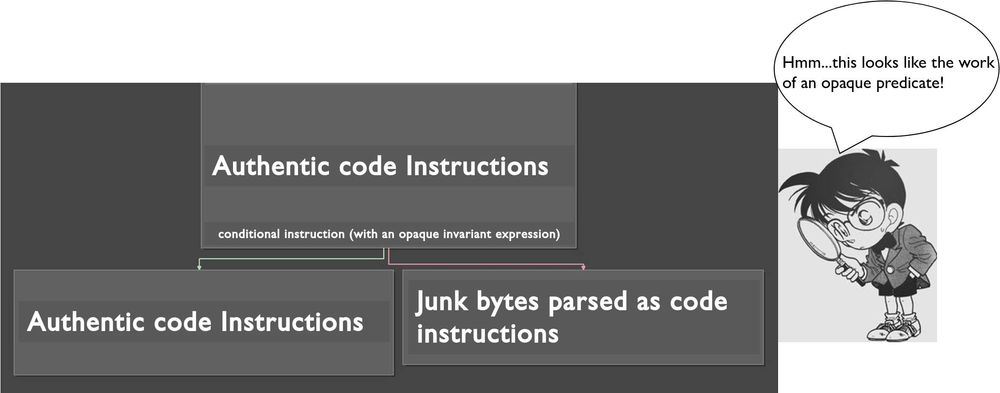
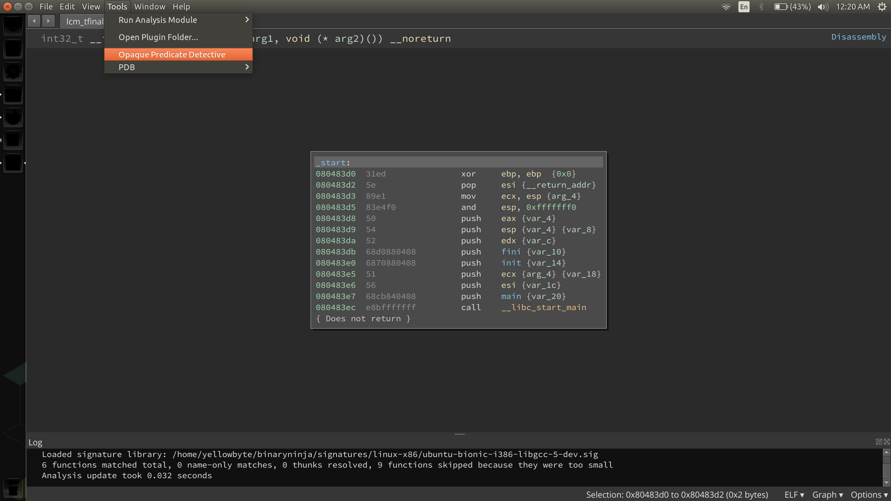
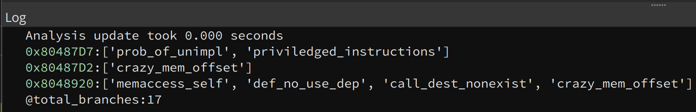

# <p align='center'> Opaque Predicates Detective </p>



## Introduction: 
Previous approaches to generically identify opaque predicates work by identifying if a conditional branch contains an invariant expression. Our approach generically identify opaque predicates from a different perspective: __the damage caused by the obfuscation__. The damage is localized at the basic block level (or at the function level) regardless of how an opaque predicate's invariant expression is constructed. This approach allows us to also detect an opaque predicate whose invariant expression is constructed across multiple processes! 

IDA also detects opaque predicates from the damage but its approach cannot identify the exact superfluous branch, [which allows for the creation of stealthier opaque predicates](https://yellowbyte.github.io/blog/2018/the_return_of_disassembly_desynchronization/).

There are two main types of damage resulting from opaque predicates: code bloat or disassembly desynchronization. __Current implementation focuses on detecting opaque predicates when the damage is disassembly desynchronization__. Disassembly desynchronization is a umbrella term for obfuscation techniques that disrupt static disassembly by the creative placement of junk bytes (random data bytes) into the instruction stream such that a disassembler will parse those junk bytes as code instructions. In the case of an opaque predicate, junk bytes are inserted into the target basic block of the opaque predicate's superfluous branch. To identify opaque predicates' superfluous branches, we analyze each conditional branch's outgoing basic blocks for __illogical behaviors__ (which can manifest from code instructions that are actually junk bytes). Note that identifying the superfluous branch will allow us to trace back to the offending opaque predicate.

Future work will look into detecting opaque predicates when the damage is code bloat.

## Identifying Illogical Behaviors
We have a set of rules that checks if a basic block contains the damage performed by opaque predicates. Essentially, the damage translates to illogical code behaviors since current approach is limited to detecting opaque predicates when the damage is [disassembly desynchronization](https://github.com/yellowbyte/reverse-engineering-reference-manual/blob/master/contents/anti-analysis/Anti-Disassembly.md#-disassembly-desynchronization-). 

The names we used for the rules in the [paper](https://archive.bar/pdfs/bar2020-preprint4.pdf) compared to the code are not the same. This means that annoyance might arise if one tries to match a rule described in paper to its actual implementation. 

Below is a Python Dictionary depicting the relationship between the names in code (dictionary key) vs in paper (dictionary value): 

```python
RULES_RELATIONSHIP = {
    # 'names in code'                   'names in paper'
    'weird_cutoff':                     'abrupt_basic_block_end',
    'prob_of_unimpl':                   'unimplemented_BNILs_percentage',
    'priviledged_instructions':         'privileged_instruction_usage',
    'def_no_use_dep':                   'defined_but_unused',
    'memaccess_self':                   'memory_pointer_constraints',
    'conditional_unused':               'defined_but_unused',
    'stack_pointer_oddity':             'memory_pointer_constraints',
    'crazy_mem_offset':                 'unreasonable_memory_offset',
    'type_discrepency_ptr_in_mult_div': 'memory_pointer_constraints',
    'memaccess_nonexist':               'nonexistence_memory_address',
    'memaccess_src_dest_discrepancy':   'memory_pointer_constraints',
    'call_dest_nonexist':               'nonexistence_memory_address',
    'jmp_dest_nonexist':                'nonexistence_memory_address',
}
```

As seen in the dictionary, it is not a one-to-one relationship. The rule names in code is more fine-grained than the rule names in paper. For example, the 'nonexistence\_memory\_address' rule (in paper) corresponds to 'memaccess\_nonexist', 'call\_dest\_nonexist', and 'jmp\_dest\_nonexist' rules (in code). 

## Detective in Action:
Current implementation is a [BinaryNinja](https://binary.ninja) plugin.

How to run plugin: 


Output:


Note that the printed virtual addresses (highlighed in green) are the target addresses of the superfluous branches. (The addresses can easily be changed to the addresses of the opaque conditional statements if desired.)

## Reference \[[link to paper](https://www.ndss-symposium.org/wp-content/uploads/2020/04/bar2020-23004-paper.pdf)\]

    @inproceedings{tungheuristic,
      title={A Heuristic Approach to Detect Opaque Predicates that Disrupt Static Disassembly},
      author={Tung, Yu-Jye and Harris, Ian G}
      booktitle={Proceedings of the NDSS Workshop on Binary Analysis Research},
      year={2020}
    }

__NOTE__: Google Scholar has the incorrect BibTex but unfortunately I cannot update it directly on Google Scholar

